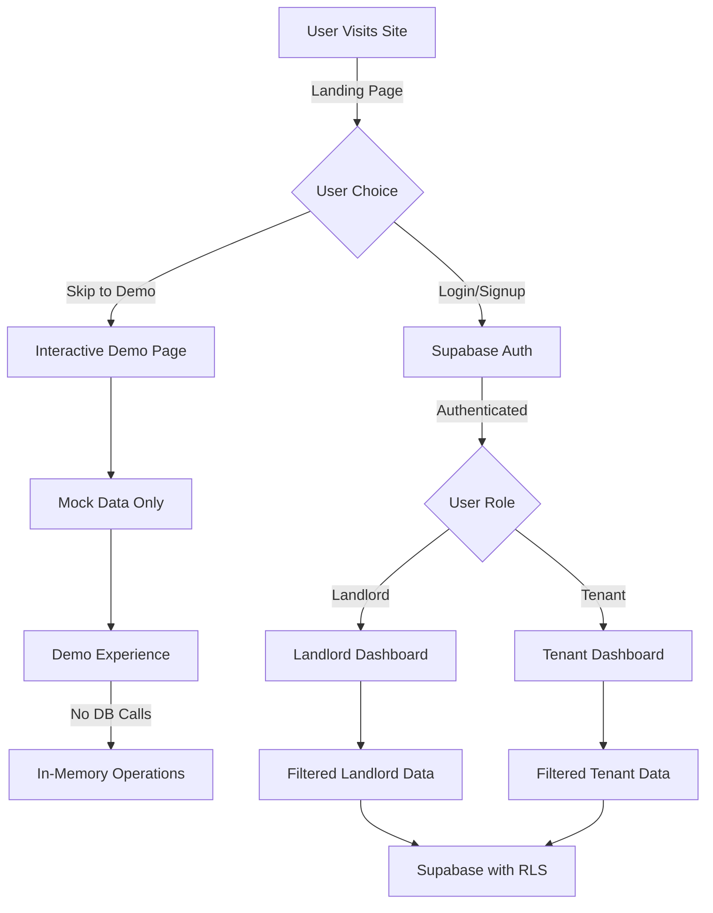

# Build Plan: Remove Mock Data and Create Interactive Demo

## Problem Statement

We need to:
1. Remove all mock data and hardcoded IDs from the authenticated application
2. Make landlord/tenant dashboards work with real Supabase data only
3. Create a separate interactive demo at `/demo` with mock data (no database calls)

## Current Issues to Fix

- **Hardcoded mock IDs**: Dashboards use `'00000000-0000-0000-0000-000000000000'` instead of real user IDs
- **No data filtering**: Stores fetch ALL data without proper landlord/tenant filtering
- **Demo bypass**: Login page has hardcoded credentials that bypass real authentication
- **Disabled auth checks**: Middleware and layout authentication are commented out

## Architecture Overview



## Implementation Steps

### 1. Fix Data Store Filtering

**File**: [`/frontend/lib/store/landlord.ts`](/frontend/lib/store/landlord.ts)
```typescript
// Line 66: Restore filtering
const { data: units } = await supabase
  .from('units')
  .select('*')
  .eq('landlord_id', landlordId); // UNCOMMENT THIS

// Line 121: Fix maintenance requests query
.eq('units.landlord_id', landlordId); // UNCOMMENT THIS
```

**File**: [`/frontend/lib/store/tenant.ts`](/frontend/lib/store/tenant.ts)
```typescript
// Line 70: Fix to use actual tenant ID
const { data: tenantData } = await supabase
  .from('tenants')
  .select('*')
  .eq('id', tenantId)  // Use actual ID
  .single();           // Get specific tenant
```

### 2. Remove Mock Data from Dashboards

**File**: [`/frontend/app/landlord/dashboard/page.tsx`](/frontend/app/landlord/dashboard/page.tsx)
```typescript
// Remove mock ID, use real auth
const { user } = await getUserWithRole();
useEffect(() => {
  if (user?.entity_id) {
    fetchLandlordData(user.entity_id);
  }
}, [user]);
```

**File**: [`/frontend/app/tenant/dashboard/page.tsx`](/frontend/app/tenant/dashboard/page.tsx)
```typescript
// Remove mock ID, use real auth
const { user } = await getUserWithRole();
useEffect(() => {
  if (user?.entity_id) {
    fetchTenantData(user.entity_id);
  }
}, [user]);
```

### 3. Fix Authentication Flow

**File**: [`/frontend/app/auth/login/page.tsx`](/frontend/app/auth/login/page.tsx)
- Remove the hardcoded demo bypass (lines 28-36)
- Remove "Demo Mode Active" message
- Ensure login uses real Supabase authentication

**File**: [`/frontend/middleware.ts`](/frontend/middleware.ts)
```typescript
// Re-enable the matcher
export const config = {
  matcher: [
    '/landlord/:path*',
    '/tenant/:path*',
    // Exclude /demo from protection
  ]
};
```

**File**: [`/frontend/app/landlord/layout.tsx`](/frontend/app/landlord/layout.tsx) & [`/frontend/app/tenant/layout.tsx`](/frontend/app/tenant/layout.tsx)
- Uncomment `await requireLandlord()` and `await requireTenant()`
- Remove 'use client' directive and restore server component

### 4. Create Interactive Demo Experience

**File**: [`/frontend/lib/demo/mockData.ts`](/frontend/lib/demo/mockData.ts)
```typescript
export const mockLandlordData = {
  landlord: {
    id: 'demo-landlord',
    full_name: 'John Demo',
    properties: 5,
    totalTenants: 12,
    // ... comprehensive mock data
  },
  units: [...],
  tenants: [...],
  maintenanceRequests: [...],
  // ... all entities
};

export const mockTenantData = {
  tenant: {
    id: 'demo-tenant',
    full_name: 'Jane Demo',
    // ... tenant mock data
  },
  lease: {...},
  payments: [...],
  maintenanceRequests: [...],
};
```

**File**: [`/frontend/app/demo/page.tsx`](/frontend/app/demo/page.tsx)
Transform from simple selector to full interactive demo:
```typescript
'use client';

import { useState } from 'react';
import LandlordDashboard from '@/components/demo/LandlordDashboard';
import TenantDashboard from '@/components/demo/TenantDashboard';
import { mockLandlordData, mockTenantData } from '@/lib/demo/mockData';

export default function InteractiveDemo() {
  const [role, setRole] = useState<'landlord' | 'tenant'>('landlord');
  const [data, setData] = useState(
    role === 'landlord' ? mockLandlordData : mockTenantData
  );

  // All operations update local state only
  const handleMaintenanceSubmit = (request) => {
    setData(prev => ({
      ...prev,
      maintenanceRequests: [...prev.maintenanceRequests, request]
    }));
  };

  return (
    <div>
      {/* Role switcher */}
      {/* Demo banner */}
      {role === 'landlord' ? (
        <LandlordDashboard data={data} onUpdate={setData} />
      ) : (
        <TenantDashboard data={data} onUpdate={setData} />
      )}
    </div>
  );
}
```

### 5. Create Demo Components

**File**: [`/frontend/components/demo/LandlordDashboard.tsx`](/frontend/components/demo/LandlordDashboard.tsx)
- Mirror the real landlord dashboard but use passed props
- All actions update local state only
- No Supabase calls

**File**: [`/frontend/components/demo/TenantDashboard.tsx`](/frontend/components/demo/TenantDashboard.tsx)
- Mirror the real tenant dashboard
- Simulate maintenance requests, payments, etc.
- Everything in-memory

### 6. Update Landing Page

**File**: [`/frontend/app/page.tsx`](/frontend/app/page.tsx)
Keep "Skip to Demo" but make it clear:
```typescript
<Link href="/demo" className="text-xs text-muted-foreground hover:text-primary">
  Try Interactive Demo (No signup required) →
</Link>
```

## Data Flow

### Authenticated Flow
1. User logs in with real credentials
2. Supabase Auth provides user ID and role
3. Dashboards fetch filtered data using authenticated user's ID
4. All operations persist to Supabase

### Demo Flow
1. User clicks "Skip to Demo" from landing page
2. Goes to `/demo` - a self-contained interactive experience
3. All data is mock data in memory
4. User can switch between landlord/tenant views
5. All operations update local state only
6. No database calls whatsoever

## Benefits

1. **Clean Separation**: Demo is completely isolated at `/demo`
2. **Real Data Integrity**: Authenticated dashboards only use real Supabase data
3. **Proper Multi-tenancy**: Each user sees only their own data
4. **Interactive Demo**: Users can explore without signup
5. **No Mock Data Pollution**: Production code has no mock data